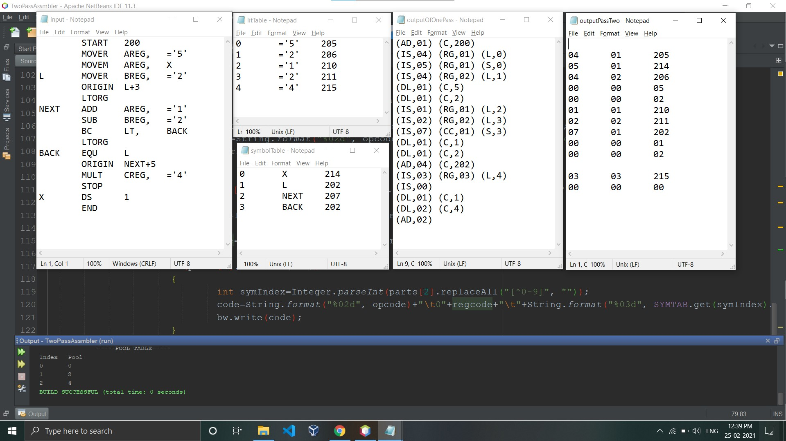
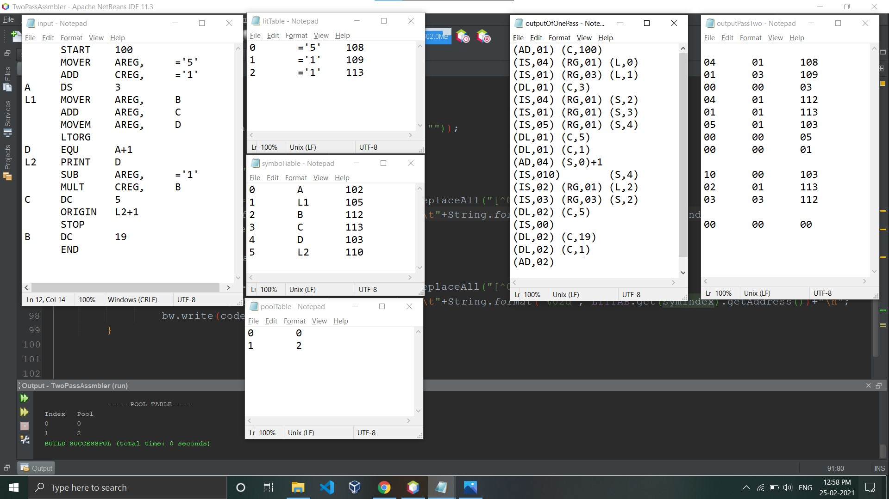

> # **Assembler**
> _An assembler is a translator, that translates an assembler program into a conventional machine language program._

 Basically, the assembler goes through the program one line at a time, and generates machine code for that instruction. Then the assembler procedes to the next instruction. In this way, the entire machine code program is created. 
> ## Two Pass Assembler 
A two pass assembler does two passes over the source file (the second pass can be over an intermediate file generated in the first pass of the assembler).
* #### Pass-1
    1. Define symbols and literals and remember them in symbol table and literal table respectively.
    1. Keep track of pool of literals in pool table.
    1. Keep track of location counter.
    1. Process pseudo-operations.

* #### Pass-2
    1. Generate object code by converting symbolic op-code into respective numeric op-code from generated intermeditae code by pass-1.
    1. Look for address values of symbols and literals and update them to generate machine code.
    
> ## Outputs

1. ### 
    
2. ### 
    